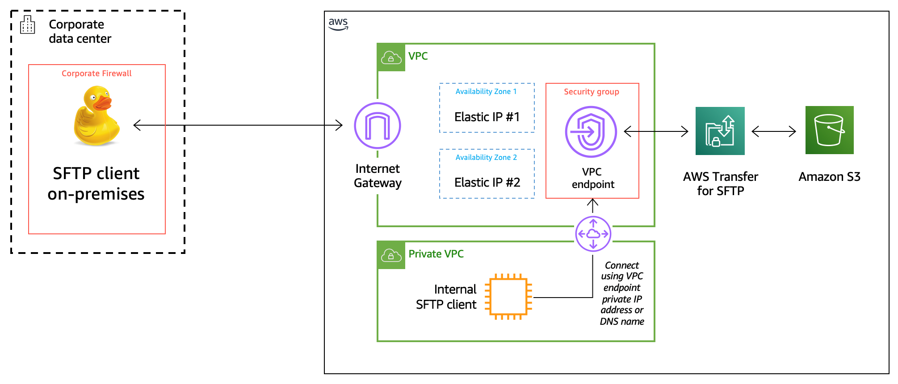

# **AWS Transfer for SFTP**

### Using IP whitelisting to secure your AWS Transfer for SFTP servers

© 2020 Amazon Web Services, Inc. and its affiliates. All rights reserved.
This sample code is made available under the MIT-0 license. See the LICENSE file.

Errors or corrections? Contact [russboye@amazon.com](mailto:russboye@amazon.com).

---

## Workshop scenario

In your application workflow, it is necessary to receive files from external entities for exchanging sensitive information such as PHI (Personal Health Information) or financial records. It is critical that these transfers be secure and encrypted.

After doing some research, you have decided to use [AWS Transfer for SFTP](https://aws.amazon.com/sftp) to receive this data from your business partners, which will allow this data to flow through an encrypted transport mechanism. In addition, your regulatory and/or Information Security guidelines dictate that only known partners are able to reach the endpoint, and this is controlled through the whitelisting of IPs. In addition, many of your partner entities face similar regulation, and need the ability to control outbound SFTP to a limited list of public IPs.

This workshop will walk you through this scenario, using CloudFormation templates to deploy resources and the AWS Management console to configure those resources accordingly.  As shown in the architecture diagram below, a VPC, two Elastic IPs, an Amazon S3 bucket, and an AWS Transfer for SFTP endpoint will be deployed as a part of this workshop.  

## Prerequisites

#### AWS Account

In order to complete this workshop, you will need an AWS account with rights to create AWS IAM roles, EC2 instances, AWS DataSync, AWS Storage Gateway and CloudFormation stacks in the AWS regions you select.

It will cost approximately 3 USD to run this workshop.  It is recommended that you follow the cleanup instructions once you have completed the workshop to remove all deployed resources and limit ongoing costs to your AWS account.

#### Software

- **Internet Browser**  – It is recommended that you use the latest version of Chrome or Firefox for this workshop.

## Workshop Modules

This workshop consists of the following five modules:

- **Module 1**  - Deploy resources in the on-premises and in-cloud regions
- **Module 2** - Initial file copy to S3 using DataSync
- **Module 3**  - Access S3 bucket on-premises using File Gateway
- **Module 4**  - One last incremental copy before cutover
- **Module 5** - Cutover to File Gateway and shutdown the NFS server

To get started, go to [Module 1](/workshops/nfs-migration/module1).
