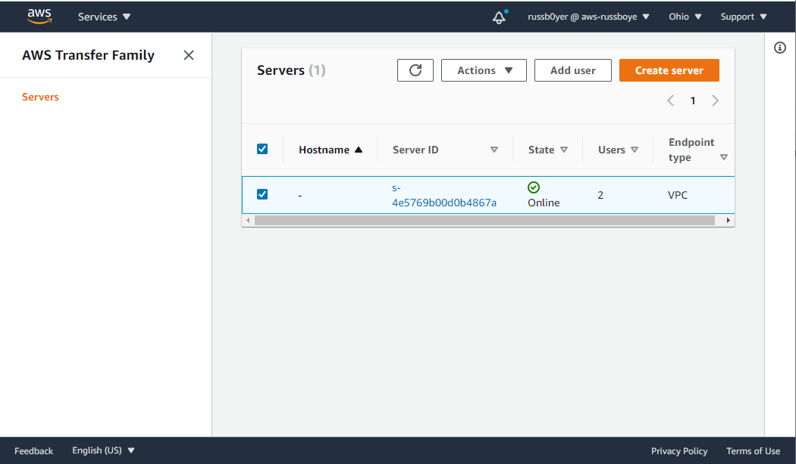
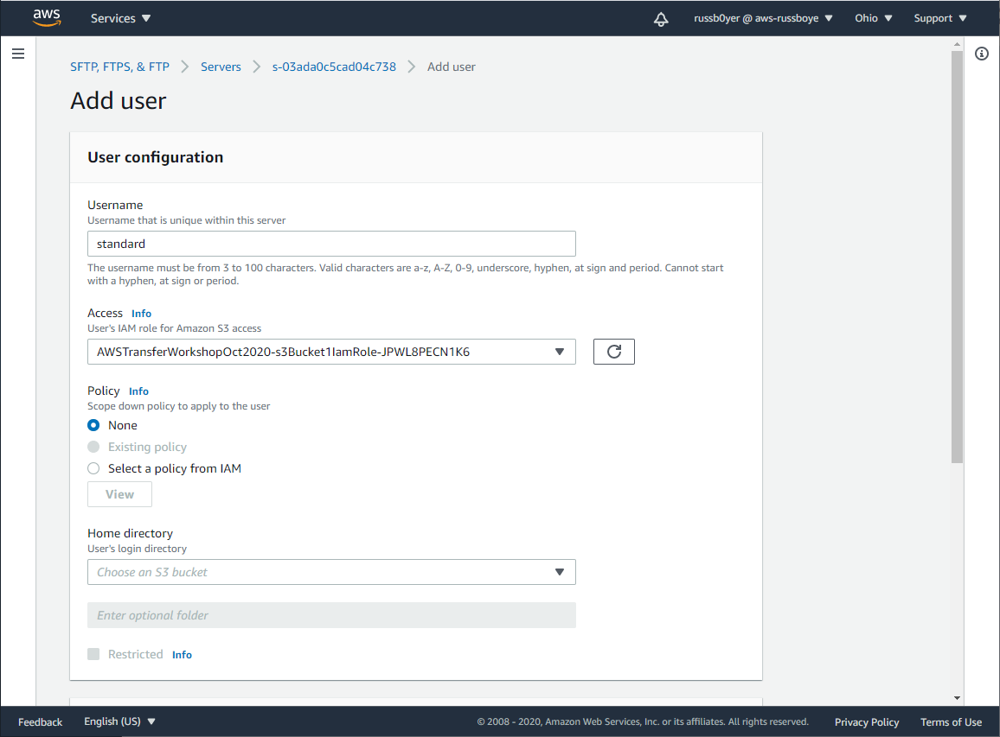
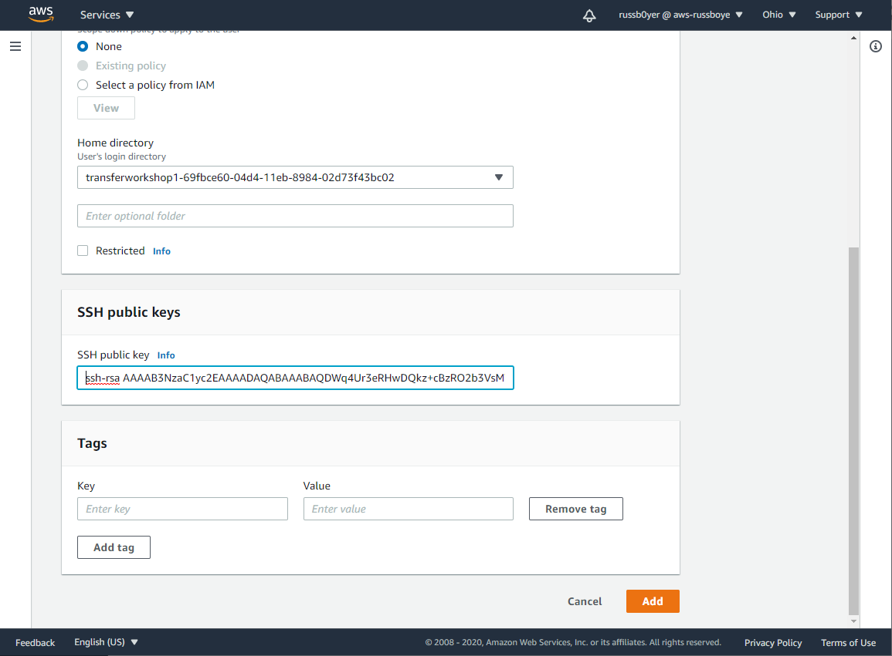
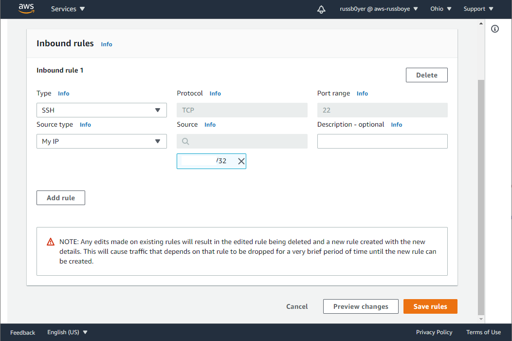
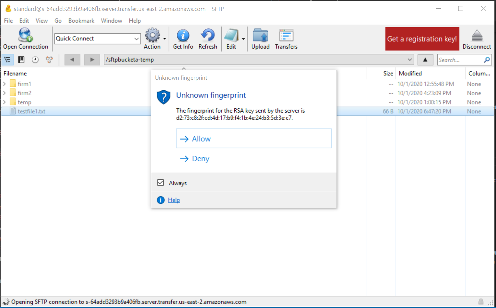
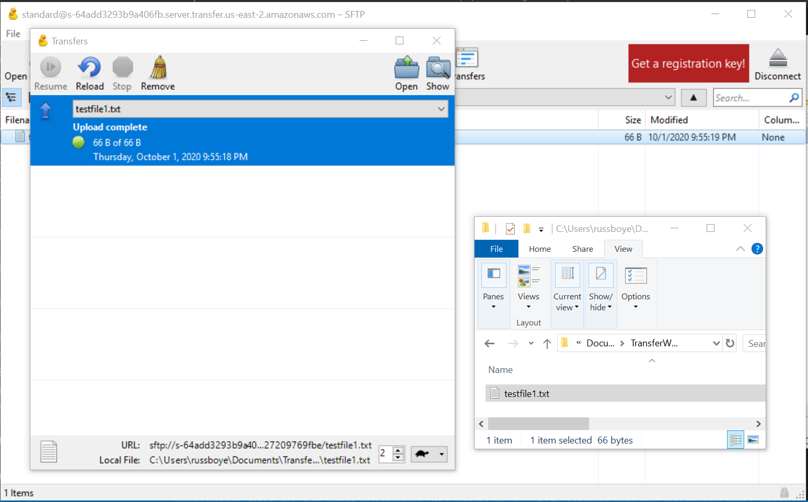
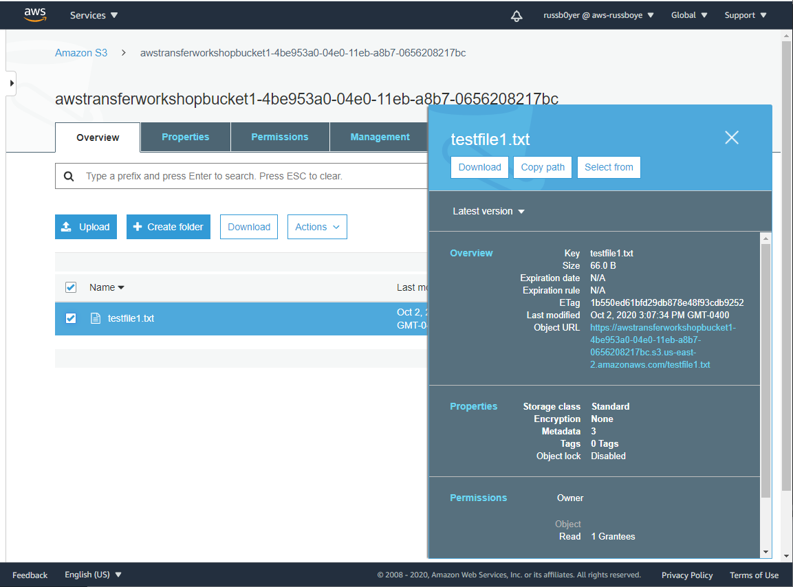

# **AWS Transfer Family**

### Using IP whitelisting and logical directories to secure your AWS Transfer Family servers

© 2020 Amazon Web Services, Inc. and its affiliates. All rights reserved.
This sample code is made available under the MIT-0 license. See the LICENSE file.

Errors or corrections? Contact [russboye@amazon.com](mailto:russboye@amazon.com).

---

# Module 2
## Testing your server whitelisting configuration

In this module, you will test access to your SFTP server either via your terminal on Linux or MacOS systems, or by using a third-party tool such as Cyberduck, WinSCP, or Filezilla. Before attempting to connect to the server, you must first return to the AWS SFTP console page for your server to [create a user account](https://docs.aws.amazon.com/transfer/latest/userguide/getting-started-add-user.html).

## Module Steps

#### Create a User Account

In order to test our server, we will need to create a user that can log in to the server. In this example, we will be using Service-managed users, which are administered inside of the **AWS Transfer** console. 

**Note** Our example uses a Service-managed identity provider for the SFTP server, which authenticates users using SSH keys. **AWS Transfer Family** also supports custom authentication methods, which allows you to do [password authentication](https://aws.amazon.com/blogs/storage/enable-password-authentication-for-aws-transfer-for-sftp-using-aws-secrets-manager/), as well as authentication via [3rd party providers](https://aws.amazon.com/blogs/storage/using-okta-as-an-identity-provider-with-aws-transfer-for-sftp/).

From the **AWS Transfer** [Console](https://console.aws.amazon.com/transfer/)

Select your Transfer server by checking the box next to it, and click **Add user**

On the Add user page, fill in a Username (here we use **standard** as the username), and select the *AWSTransferWorkshopOct2020-s3Bucket1IamRole* role that the cloudformation template created in Module 1. For now we will not be using a Scope down policy, so leave None checked. 

For the bucket, select the bucket *transferworkshop1-* in your cloudformation template. In the blank for SSH public keys, you will need to enter the public SSH key portion of an SSH key pair that you have access to. For more information on SSH key pairs, including how to generate one, you can [follow this link.](https://docs.aws.amazon.com/transfer/latest/userguide/key-management.html#sshkeygen) For the remaining options, you can leave the defaults, and click **Add**

#### Test your Connection

Once you’ve created a user account, you’re able to attempt to connect to your SFTP server using the private key that corresponds with the public key used during user creation. Using the hostname of your SFTP server, try to connect using your preferred SFTP client. At this point, you should experience a timeout, such as the one shown in the following screenshot. This is because your IP address has not been configured to reach the **VPC endpoint** over the appropriate port.

Return to the settings page in the AWS Management Console for the Security Group associated with your VPC. On the settings page, choose the **Inbound Rules** tab, and choose **Edit inbound rules**. Select **SSH** as the **Type** - this automatically selects the appropriate protocol and port range for SFTP.  For the purposes of this exercise, select **My IP** under **Source type** - this automatically populates the IP address from which you logged into the console. Scroll to the bottom, and choose **Save rules**:

You will now see an inbound rule in your security group that gives your IP address access to your VPC via port 22, which gives you access to your SFTP server.

Now that this rule is in place, attempt to connect to your session again from your SFTP client. As shown in the following screenshot, you will need to accept the server key since it is your first time connecting to this server.

 Optionally you can upload a file using your SFTP client:

And then view it in the **Amazon S3** console

## Module Summary

In this module, you tested your ability to reach your AWS Transfer for SFTP server endpoint both with and without your IP address whitelisted. This demonstrates that non whitelisted traffic does not, in fact, actually even reach your AWS SFTP endpoint.

You may have noticed in this module, however, that the user that we created has access to the entire S3 bucket contents, and all subfolders. In a real world scenario, organizations require the ability to grant select users access to particular folders. 

In the next module, we will leverage **logical directories** to demonstrate how to accomplish user separation and selective folder access. 

Go to [Module 3](/module3/README.md).
