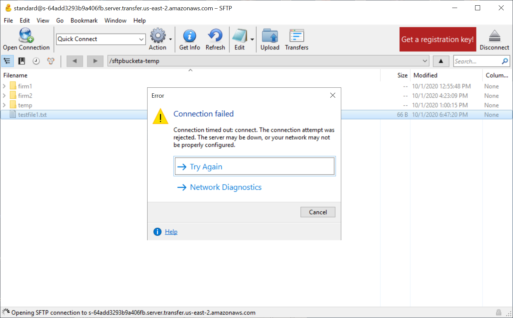

# **AWS Transfer for SFTP**

### Using IP whitelisting to secure your AWS Transfer for SFTP servers

© 2020 Amazon Web Services, Inc. and its affiliates. All rights reserved.
This sample code is made available under the MIT-0 license. See the LICENSE file.

Errors or corrections? Contact [russboye@amazon.com](mailto:russboye@amazon.com).

---

# Module 3
## Testing your configuration

In this module, you will test access to your SFTP server either via your terminal on Linux or MacOS systems, or by using a third-party tool such as Cyberduck, WinSCP, or Filezilla. Before attempting to connect to the server, you must first return to the AWS SFTP console page for your server to [create a user account](https://docs.aws.amazon.com/transfer/latest/userguide/getting-started-add-user.html).

**Note:** Our example uses a Service-managed identity provider for the SFTP server, which authenticates users using SSH keys.  AWS Transfer for SFTP also supports custom authentication methods, which allows you to do [password authentication](https://aws.amazon.com/blogs/storage/enable-password-authentication-for-aws-transfer-for-sftp-using-aws-secrets-manager/), as well as authentication via [3rd party providers](https://aws.amazon.com/blogs/storage/using-okta-as-an-identity-provider-with-aws-transfer-for-sftp/).

## Module Steps

#### Test your Connection

Once you’ve created a user account, you’re able to attempt to connect to your SFTP server using the private key that corresponds with the public key used during user creation. Using the hostname of your SFTP server, try to connect using your preferred SFTP client. At this point, you should experience a timeout, such as the one shown in the following screenshot. This is because your IP address has not been configured to reach the VPC over the appropriate port.

Return to the settings page in the AWS Management Console for the Security Group you created earlier. On the settings page, choose the **Inbound Rules** tab, and choose **Edit Rules**. Select **SSH** as the **Type** - this automatically selects the appropriate protocol and port range for SFTP.  For the purposes of this exercise, select **My IP** under **Source** - this automatically populates the IP address from which you logged into the console. Enter a description, and choose **Save Rules**:

Once you have added the new rule to your security group, select **Close**. You now see an inbound rule in your security group that gives your IP address access to your VPC via port 22, which gives you access to your SFTP server.

Now that this rule is in place, attempt to connect to your session again from your SFTP client. As shown in the following screenshot, you should now be able to connect to your SFTP session. Optionally you can upload a file and view it in the S3 console.

## Module Summary

In this module, you tested your ability to reach your AWS Transfer for SFTP server endpoint both with and without your IP address whitelisted. This demonstrates that non whitelisted traffic does not, in fact, actually even reach your AWS SFTP endpoint.

In the next module, you will clean up the resources deployed in this workshop, to prevent incurring any additional charges.

Go to [Module 4](/module4/README.md).
